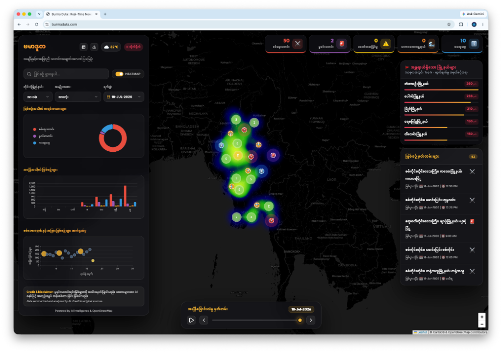
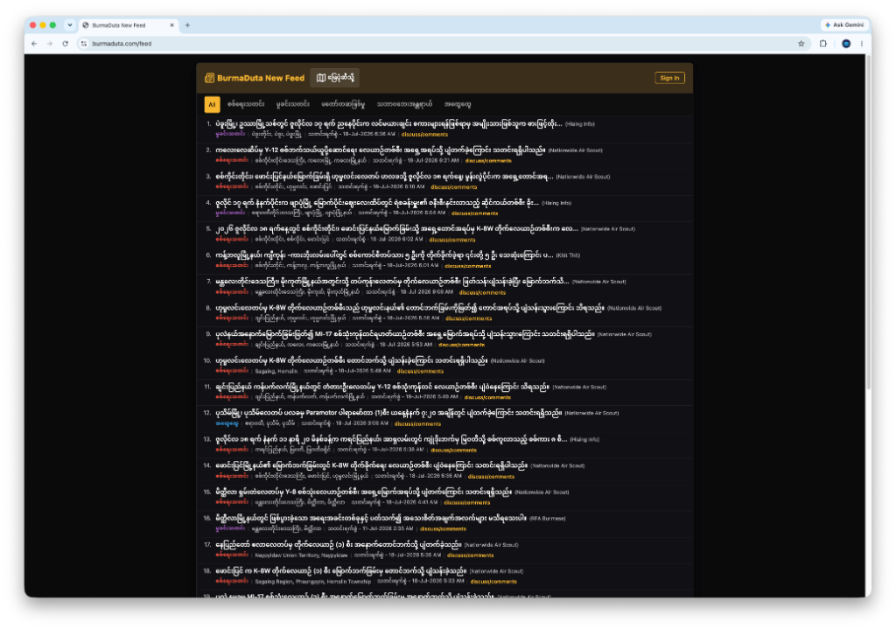
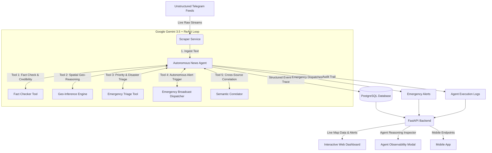

<p align="center">
  
</p>

# 🇲🇲 Burma Duta (ဗမာဒူတ)
> **Real-time News Intelligence & Visualization for Myanmar.**
> **Live Demo:** [https://www.burmaduta.com](https://www.burmaduta.com)

Burma Duta is a sophisticated news intelligence platform designed to monitor public data streams in real-time. It leverages an advanced AI-powered analytical engine to transform raw, unstructured text into categorized, geo-tagged incident reports, visualized through a high-performance interactive dashboard.





## 🤖 Autonomous Multi-Tool Agentic Engine

Burma Duta is powered by an **Autonomous Multi-Tool Agentic Workflow** leveraging **Google Gemini 3.5 Flash** (via `google-genai` SDK) and a deterministic **ReAct (Reasoning + Acting)** execution loop. The agent runs autonomously in the background, ingesting chaotic, unstructured crisis streams from Myanmar Telegram channels without human intervention.

### 🛠️ The 5 Specialized Autonomous Agent Tools:
1. **`tool_fact_checker`**: Analyzes news for misinformation, propaganda patterns, clickbait markers, and unverified rumors. Computes Credibility Score (0-100%) and Assigns Verdict (`VERIFIED`, `PLAUSIBLE`, `DISPUTED`, `FAKE_NEWS`, `SPAM`).
2. **`tool_geo_inferencer`**: Solves missing GPS coordinates via Myanmar spatial reasoning, 330+ administrative township ontology, landmark entity extraction, and OpenStreetMap Nominatim fallback.
3. **`tool_emergency_triager`**: Identifies life-threatening emergencies (Landslides, Flash Floods, Earthquakes, Cyclones, Artillery Shelling, Airstrikes) and classifies Priority Levels (`CRITICAL_EMERGENCY`, `HIGH_PRIORITY`, `STANDARD`, `LOW_NOISE`).
4. **`tool_emergency_broadcaster`**: When a critical emergency is confirmed, the agent autonomously dispatches a live Emergency Broadcast Alert across the UI banner, map pulse indicators, and live stream API.
5. **`tool_semantic_correlator`**: Evaluates cross-channel corroboration to reinforce verified reports.

---

## 🛠️ Technology Stack

<p align="left">
  
  
  
  
  
  
  
  
</p>

---

## ✨ Key Features

-   🤖 **Autonomous ReAct Agent Engine**: Multi-tool reasoning loop that understands, fact-checks, geo-locates, and acts on Myanmar crisis news in real time.
-   🚨 **Autonomous Emergency Broadcasts**: Instantaneous alerting for natural disasters (landslides, earthquakes, floods) and high-severity conflict hotspots.
-   📍 **Intelligent Geospatial Mapping**: Inferred coordinates with confidence scoring and interactive Leaflet map visualization.
-   🔍 **Full Reasoning Observability & Audit Trail**: Real-time inspection modal detailing every thought, tool invocation, and decision step (`/api/agent/runs`).
-   🕹️ **Live Interactive Agent Sandbox**: Test the agent on arbitrary text inputs with step-by-step latency & reasoning logs (`/api/agent/analyze`).
-   🔮 **Conflict Trend Forecasting**: A time-series ML engine (Facebook Prophet) predicting conflict trajectories for active townships.
-   🧲 **Semantic De-duplication**: Sentence-BERT embedding similarity to eliminate duplicate cross-channel reports.
-   👥 **Community Discussion & AI Moderation**: Authenticated comments protected by Gemini AI moderation filter against hate speech and harassment.

---

## 🏗️ System Architecture



### Components
1. **Autonomous News Agent (`agent_core.py`)**: Google Gemini 3.5 ReAct engine with 5 specialized tools for fact-checking, spatial reasoning, emergency triage, and broadcast alerting.
2. **Web Dashboard (`frontend/index.html`, `app.js`)**: Interactive Leaflet & ECharts dashboard featuring real-time Emergency Alert Banner, Fact-Check badges, and the Agent Reasoning Inspector Modal.
3. **Agent Sandbox Drawer**: Interactive live test environment for judges and users to test arbitrary inputs.
4. **Backend API (`api.py`)**: High-performance FastAPI backend with endpoints for agent alerts (`/api/agent/alerts`), audit runs (`/api/agent/runs`), and interactive analysis (`/api/agent/analyze`).
5. **Database**: PostgreSQL schema with automated migrations for agent traces, emergency alerts, and audit logs.

## 🚀 Deployment

Burma Duta is designed to be deployed effortlessly on any Linux-based VPS or cloud provider.

### 1. Pre-requisites
Ensure you have the following **private** files ready (do not commit these to source control):
-   `.env`: Containing your `INTERNAL_STORE_URI`, `ALLOWED_ORIGINS`, and `API_KEY` (see `.env.example`).
-   `sessions/burmaduta.session`: Your authenticated Telegram session file (must be inside the `sessions` directory if running the scraper).

### 2. Automated Installation
Run the deployment script to prepare your server environment (Docker, Docker Compose, Swap configuration):
```bash
curl -O https://raw.githubusercontent.com/burmeseitman/burmaduta/main/deploy.sh && chmod +x deploy.sh && ./deploy.sh
```

### 3. Launching the Stack
Once your configuration files are in place, start the backend ecosystem:
```bash
docker-compose up -d --build
```
The API will be accessible at `http://[your-ip]:8081`.

The API validates its environment on start-up and exits rather than falling back
to an insecure default. To check a configuration before restarting a live
service, run the same validation without touching the database:
```bash
docker compose exec api python backend/config.py
```

### Network exposure

The API port is published on `127.0.0.1` only, so it is reachable through the
reverse proxy and not from the internet. This is deliberate: `ufw` does **not**
filter Docker-published ports, because Docker DNATs them through `FORWARD` while
`ufw` filters `INPUT`. Binding to `0.0.0.0` therefore exposes the API regardless
of the firewall rules.

Verify from another machine — this should time out or refuse:
```bash
curl -m 5 -sI http://YOUR_VPS_IP:8081/
```

If the site breaks after this change, your proxy is not reaching the API over
host loopback. Revert immediately by setting `API_BIND_HOST=0.0.0.0` in `.env`
and running `docker-compose up -d`. Two cases need a different fix instead:

-   **Proxy runs in its own container** — it cannot reach host loopback. Remove
    the `ports:` mapping entirely, put both services on a shared Docker network,
    and point the proxy at `http://api:8081`.
-   **No reverse proxy at all** — install one before closing the port.

### 4. Frontend Global Deployment
For optimal performance, host the `frontend` directory on a CDN (e.g., Cloudflare Pages, Netlify).
Before deploying, compile the frontend to inject your API keys and Base URL securely:
```bash
API_BASE_URL=https://api.yourdomain.com API_KEY=your_secret_api_key node build.js
```
Then upload the compiled `frontend` directory to your hosting provider.

## 📄 License

This project is licensed under the MIT License - see the [LICENSE](LICENSE) file for details.

---
"Building software at the speed of thought."
