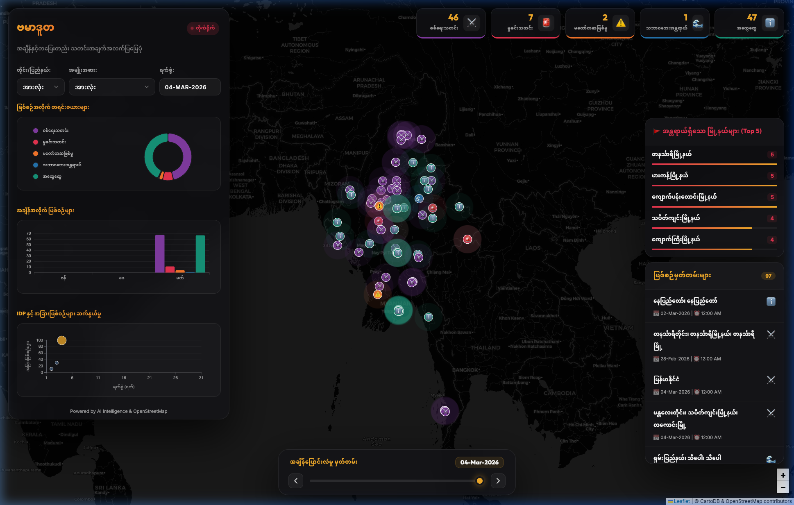
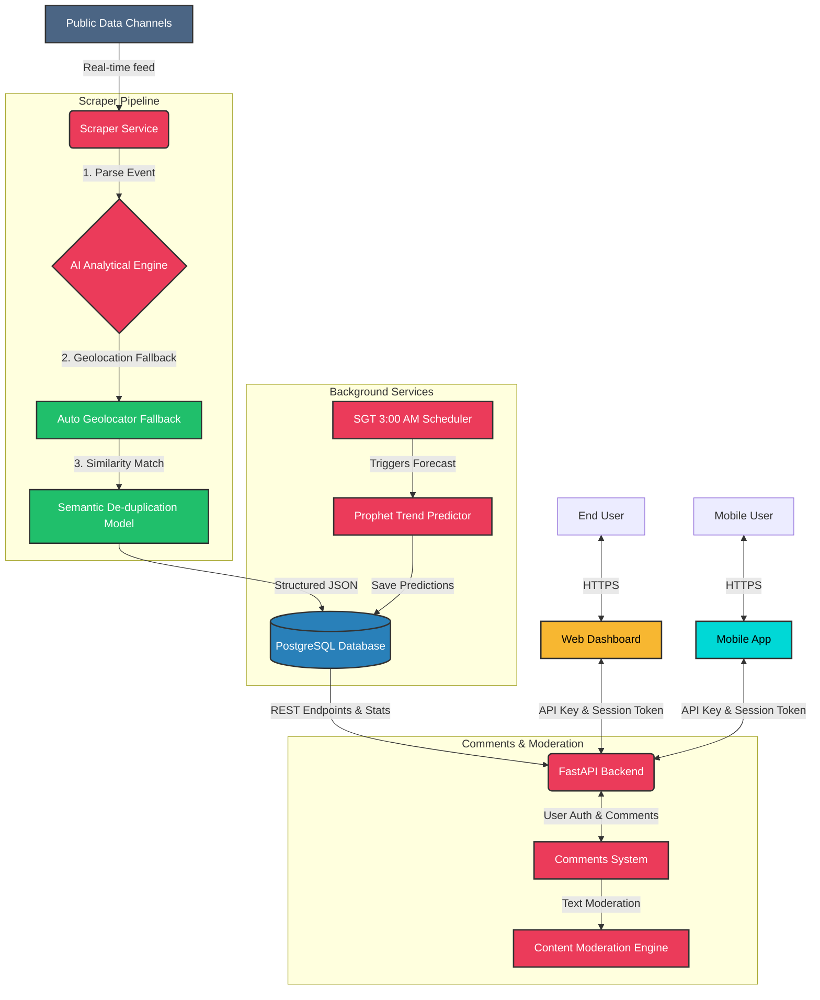

<p align="center">
  
</p>

# 🇲🇲 Burma Duta (ဗမာဒူတ)
> **Real-time News Intelligence & Visualization for Myanmar.**
> **Live Demo:** [https://www.burmaduta.com](https://www.burmaduta.com)

Burma Duta is a sophisticated news intelligence platform designed to monitor public data streams in real-time. It leverages an advanced AI-powered analytical engine to transform raw, unstructured text into categorized, geo-tagged incident reports, visualized through a high-performance interactive dashboard.



## ✨ Key Features

-   📡 **Real-time Multi-Channel Monitoring**: Continuously tracks diverse news sources and public announcement channels for instantaneous awareness.
-   🧠 **Advanced AI Categorization**: Implements a hierarchical classification system (Conflict, Crime, Accident, Disaster, General) with granular sub-category extraction (e.g., Airstrikes, IDPs, Robbery).
-   📍 **Intelligent Geospatial Mapping**: Automatically geocodes incident locations using both AI logic and fallback OpenStreetMap (Nominatim) integration.
-   📊 **Interactive Narrative Dashboard**: Professional-grade visualizations using ECharts, including temporal trends, category distributions, and correlation analysis (e.g., IDP vs. Conflict).
-   🔄 **Optimized AI Processing**: Features context caching for batch processing, significantly reducing latency and operational costs while maintaining high extraction accuracy.
-   🛡️ **Decoupled & Secure Architecture**: Built with a modular approach (FastAPI + Vanilla JS + PostgreSQL), featuring hardened Docker configurations with non-root execution.
-   🗺️ **Interactive Heatmap Layer**: Real-time visualization of incident density to identify regional hotspots.
-   🔍 **Advanced Keyword Search**: Instant searching across incident logs and locations for rapid data retrieval.
-   📥 **Research Data Export**: Clean CSV export of filtered data with automated column filtering for privacy.
-   🐳 **Automated Deployment**: One-command setup script for cloud environments with full Docker & Docker Compose support.

## 🛠️ Technology Stack

<p align="left">
  
  
  
  
  
  
  
  
  
  
</p>

## 🏗️ System Architecture

The project is architected for maximum flexibility. The frontend is entirely static, enabling global distribution via CDNs, while the backend handles high-concurrency data ingestion and AI processing.



### Components
1. **Web Dashboard**: Pure HTML5/CSS3/Vanilla JS. No complex frameworks, ensuring ultra-fast load times and zero dependency bloat.
2. **Mobile App**: A cross-platform React Native (Expo) application providing native map experiences and on-the-go real-time notifications.
3. **Backend API**: Optimized FastAPI services providing efficient data retrieval, secured by **API Key Authentication** to prevent public scraping.
4. **Scraper & AI Processor**: A dedicated worker utilizing LLM intelligence for entity recognition (Location, Event Type, Timestamp, People involved) and data cleaning.
5. **Database**: Robust PostgreSQL schema designed for incident tracking and system-wide configuration management.

## 🚀 Deployment

Burma Duta is designed to be deployed effortlessly on any Linux-based VPS or cloud provider.

### 1. Pre-requisites
Ensure you have the following **private** files ready (do not commit these to source control):
-   `.env`: Containing your `DATABASE_URL` and `PROCESSOR_KEY`.
-   `sessions/burmaduta.session`: Your authenticated Telegram session file (must be inside the `sessions` directory).

### 2. Automated Installation
Run the deployment script to prepare your server environment (Docker, Docker Compose, Swap configuration):
```bash
curl -O https://raw.githubusercontent.com/burmeseitman/burmaduta/main/deploy.sh && chmod +x deploy.sh && ./deploy.sh
```

### 3. Launching the Stack
Once your configuration files are in place, start the entire ecosystem:
```bash
docker-compose up -d --build
```
The API will be accessible at `http://[your-ip]:8081`.

### 4. Frontend Global Deployment
For optimal performance, host the `frontend` directory on a CDN (e.g., Cloudflare Pages, Netlify). Update `frontend/app.js` with your production API URL before deployment.

## 📄 License

This project is licensed under the MIT License - see the [LICENSE](LICENSE) file for details.

---
"Building software at the speed of thought."
