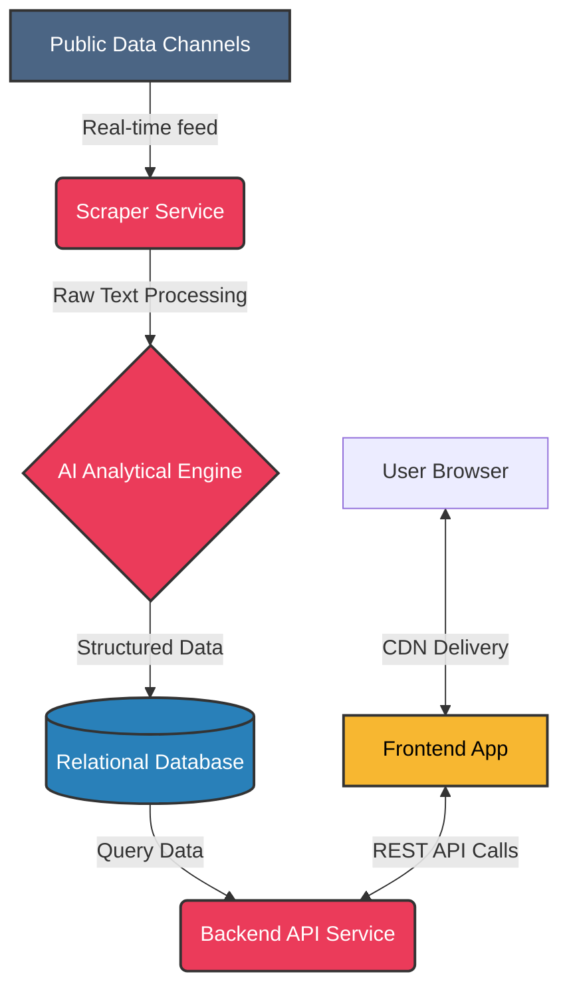

<p align="center">
  
</p>

# 🇲🇲 Burma Duta (ဗမာဒူတ)
> **Real-time News Intelligence & Visualization for Myanmar.**
> **Live Demo:** [https://www.burmaduta.com](https://www.burmaduta.com)

Burma Duta is a news intelligence platform that monitors public data channels in real-time, extracts meaningful information using an AI-powered analytical engine, and visualizes incidents on an interactive map with integrated statistical analytics.


## ✨ Key Features

-   📡 **Real-time Monitoring**: Simultaneously tracks multiple news sources and public channels for up-to-the-minute awareness.
-   🧠 **AI-Powered Analysis**: Automatically parses raw news text into structured data (category, location, time, and summary) using advanced LLM intelligence.
-   🚩 **Incident Ranking**: Visualizes areas with high incident density to help identify regional trends.
-   📊 **Interactive Dashboard**: High-end data visualization using a professional charting suite and status indicators.
-   📍 **Geospatial Mapping**: Visualizes events using an interactive map interface with category-specific categorization and filters.
-   🐳 **Easy Deployment**: Full support for Docker and Docker Compose for fast setup on any environment, with decoupled architecture capabilities.

## 🛠️ Technology Stack

<p align="left">
  
  
  
  
  
  
  
  
</p>

## 🏗️ System Architecture

The project is built with a highly decoupled architecture, allowing for independent scaling and deployment of the frontend, backend API, and data scraping services.



### Components
1. **Frontend (Client-Side)**: A purely static HTML/CSS/JS application. Can be hosted globally on any CDN (e.g., Cloudflare Pages, Vercel, Netlify) for edge-level performance.
2. **Backend API (FastAPI)**: A lightweight Python web server connecting the database to the frontend via REST endpoints. Cross-Origin Resource Sharing (CORS) is enabled to support decoupled frontend hosting.
3. **Scraper & AI Processor**: A background worker that listens to continuous data streams, processes the raw text securely via an AI model to extract entities (Location, Type, Time), and stores them.
4. **Database (PostgreSQL)**: The central source of truth for all structured incident data and system configurations.

## 🚀 Deployment

The easiest way to deploy the backend services of Burma Duta is using the automated setup script, optimized for lightweight virtual private servers.

### 1. Automated Setup
Once you have your server provisioned, run this single command to install necessary containerization tools and configure swap memory for stability:
```bash
curl -O https://raw.githubusercontent.com/[your-repo]/main/deploy.sh && chmod +x deploy.sh && ./deploy.sh
```

### 2. Configuration
Copy your `.env` configuration file and your authenticated `data_source.session` file to the project root directory.

### 3. Launch Backend Services
```bash
docker-compose up -d --build
```
The API will be available at `http://[your-server-ip]:8081`.

### 4. Frontend Deployment (Optional Decoupled Route)
To serve the frontend via a CDN:
1. Point your CDN provider to the `frontend` directory of your repository.
2. Update the `API_BASE_URL` in `frontend/app.js` to point to your backend API domain.
3. Deploy the application globally.

## 📄 License

This project is licensed under the MIT License - see the [LICENSE](LICENSE) file for details.

---
"Building software at the speed of thought."
